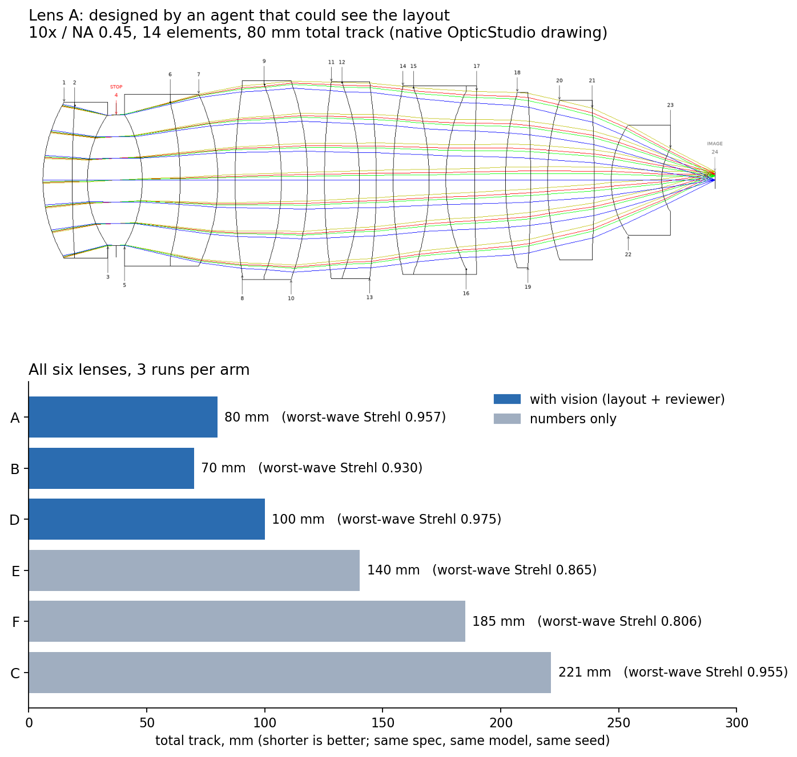
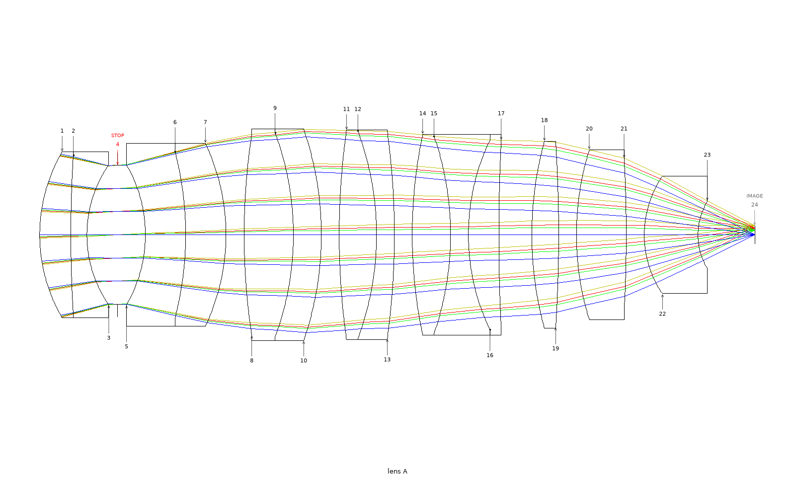
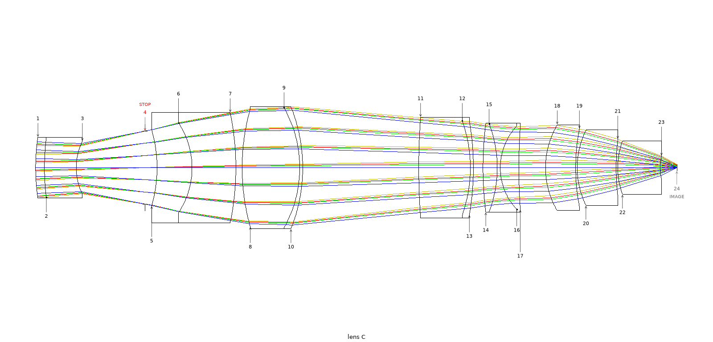

# Demo: does the agent design a better lens when it can see the drawing?

**Short answer: in this test, yes.** Every lens the agent designed with the layout review was
shorter than every lens it designed from numbers alone: **70–100 mm against 140–221 mm** total
track, with no overlap. Image quality held: every vision lens kept an on-axis **Strehl ratio of
0.93 or better at all four wavelengths** (worst cases 0.957, 0.930 and 0.975), while the two
lowest Strehl values of the whole test, 0.865 and 0.806, were both numbers-only lenses. No lens
had a clearance violation.

Three runs per arm is a pattern, not a rate. Read the limits at the end before you quote it.

## The test

One design task, run six times with no human in the loop:

- **The task.** Start from a 60× dry apochromat and rework it into a **10× / NA 0.45** microscope
  objective with **at least 5 mm working distance**, keeping **14 elements**.
- **Held equal in both arms.** The same model (Claude Opus 5.5), the same seed lens, the same
  OptiVibe MCP server, and the same time cap. The briefs were frozen before the first run, and
  the runner refused to start if any input had changed.
- **With vision (3 runs).** The agent could look at OpticStudio's own layout drawing of each saved
  candidate and ran the `design-vision-review` skill. The brief asked it to look at the layout
  before accepting a round and to take the reviewer's findings seriously. With no human present,
  it had to answer each finding with a measurement, then act on it or decline it.
- **Numbers only (3 runs).** Same task, no tool that can show a picture, no review.

Each finished lens was measured afterwards by one script, the same way for all six.

## Results

| lens | arm | total track (mm) | EFL (mm) | on-axis Strehl, waves 1 / 2 / 3 / 4 | min air gap, centre / edge (mm) | thinnest element, centre thickness ÷ diameter | clearance violations |
|---|---|---|---|---|---|---|---|
| A | vision | 79.9 | 20.01 | 0.974 / 0.992 / 0.981 / 0.957 | 2.00 / 1.03 | 0.086 | 0 |
| B | vision | 70.0 | 20.00 | 0.930 / 0.982 / 0.963 / 0.981 | 0.53 / 0.96 | 0.051 | 0 |
| D | vision | 100.0 | 20.00 | 0.983 / 0.986 / 0.975 / 0.983 | 0.99 / 1.02 | 0.089 | 0 |
| C | numbers only | 221.3 | 20.02 | 0.977 / 0.984 / 0.966 / 0.955 | 0.53 / 1.71 | 0.025 | 0 |
| E | numbers only | 140.3 | 20.00 | 0.992 / 0.977 / 0.980 / 0.865 | 0.52 / 1.98 | 0.039 | 0 |
| F | numbers only | 185.0 | 20.01 | 0.992 / 0.994 / 0.978 / 0.806 | 0.52 / 2.18 | 0.033 | 0 |

What the table shows:

- **Length.** With vision: 70, 80 and 100 mm. Numbers only: 140, 185 and 221 mm.
- **Image quality.** Every lens holds a Strehl of 0.93 or better at every wavelength, except two
  numbers-only lenses at wave 4 (E at 0.865, F at 0.806).
- **Thin elements.** The thinnest element is thicker in every vision lens (0.051–0.089) than in
  any numbers-only lens (0.025–0.039). The longest lens, C, also has the thinnest element.
- **Focal length and clearance.** All six hold the 20 mm focal length and pass the clearance
  floors (1.0 mm glass, 0.5 mm air).
- **Failed runs.** The vision arm finished all 3 of its attempts. The numbers-only arm needed 6
  attempts for 3 lenses: one machine crash, and two runs that stalled inside a single optimizer
  call.

## Two of the six lenses, as OpticStudio draws them

| Lens A — with vision, 80 mm | Lens C — numbers only, 221 mm |
|---|---|
|  |  |

Each drawing is scaled to fit its frame, so compare the lengths in the table above, not by eye.

The six lenses were also re-drawn under shuffled letters for a blind look. The person who
designed the test sorted all six into the right arms and picked A as the best-looking. That sort
was not fully blind: they knew beforehand that the vision lenses were the shorter ones, and
length shows in the drawing.

## Limits

- **Three runs per arm.** A difference that holds in all three pairs is a pattern worth
  reporting. It is not a measured rate.
- **The review came as one package with the brief's wording.** The vision brief also asks the
  agent to look before accepting a round, so this test cannot say whether the reviews or the
  wording did the work. An arm with the vision brief but no picture tools would separate them.
- **One task, one model.** Nothing here says how the result carries to other lens types or
  other models.

## Try it

The vision loop ships in this release: `render_layout` draws with OpticStudio's own layout by
default, and the `optimize-loop` and `design-vision-review` skills run the review. See the
[CHANGELOG](../../CHANGELOG.md) for the 0.1.13 changes.
